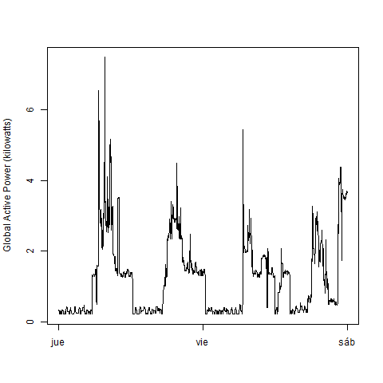
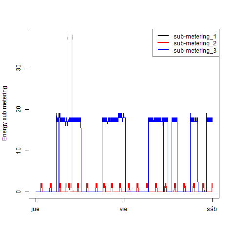
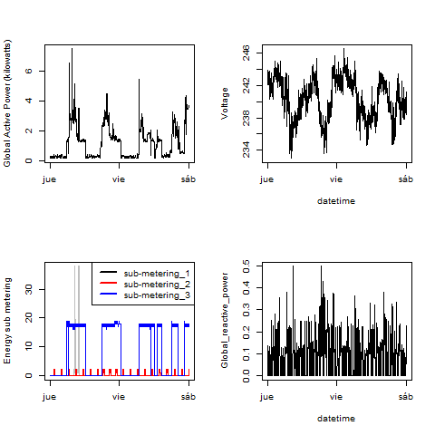

# ExData_Plotting_E1

##Assignment 1 week 1 coursera Exploratory Data analisys

## Reading data

As the data is very large, we select the data ussing a text editor (sublime) the lines corresponding to  the dates 2007/02/01 and  2007/2/2.

We will read the file between lines 66638 and 69517 using read.table

As NA= ? we will use `na.strings = "?"`
the code we use is:

```{r}
# household_power_consumption.txt
# nrow corresponding 2007/02/01 to 2007/2/02 --> 66637 to 69517
nombres <- c("Date", "Time", "Global_active_power", "Global_reactive_power", "Voltage", "Global_intensity", "Sub_metering_1", "Sub_metering_2", "Sub_metering_3")
data <- read.table("household_power_consumption.txt", skip = 66637, nrows = 69517 - 66637, sep = ";", na.strings = "?",col.names=nombres )

# summary data
dim (data)
str(data)
summary(data)

```

I firts explore the data with summary(), dim() and str() commands

As we need data class for some plots, I add a new column to data:

```{r}
# create a new var class POSIXlt, col 10
data$DateTime <- strptime(paste(data$Date, data$Time, sep=" "), "%d/%m/%Y %H:%M:%S")
```

## plot 1

we first plot on screen and then in a png file
```{r}
# plot in screem 
hist(data$Global_active_power, xlab="Global Active Power (kilowatts)", main="Global Active Power", col="wheat")

# plot in png
png('plot1.png',width = 480, height = 480, units = "px")
hist(data$Global_active_power, xlab="Global Active Power (kilowatts)", main="Global Active Power", col="red")
dev.off()

```
### Result

 

## plot 2

```{r}
# plot 2
plot(data$DateTime, data$Global_active_power, ylab="Global Active Power (kilowatts)", xlab="", type="n")
lines(data$DateTime, data$Global_active_power, type= "l")
# copy from screen to png
dev.copy(png,"plot2.png")
dev.off()
```

 

## Plot 3

```{r}
# plot 3
png('plot3.png',width = 480, height = 480, units = "px")
plot(data$DateTime, data$Sub_metering_1, ylab="Energy sub metering", xlab="", type="n")
lines(data$DateTime, data$Sub_metering_1, type= "l", col="grey")
lines(data$DateTime, data$Sub_metering_2, type= "l", col="red")
lines(data$DateTime, data$Sub_metering_3, type= "l", col="blue")
# Add legend
legend("topright",legend=c("sub-metering_1","sub-metering_2","sub-metering_3"),col=c("black","red","blue"),lty=c(1,1,1),lwd=2)
dev.off()
```
 

### Plot 4
```{r}
# plot 4
png('plot4.png')
par(mfrow=c(2,2)) # all plots on one page 

plot(data$DateTime, data$Global_active_power, ylab="Global Active Power (kilowatts)", xlab="", type="n")
lines(data$DateTime, data$Global_active_power, type= "l")

plot(data$DateTime, data$Voltage, ylab="Voltage", xlab="datetime", type="n")
lines(data$DateTime, data$Voltage, type= "l")

plot(data$DateTime, data$Sub_metering_1, ylab="Energy sub metering", xlab="", type="n")
lines(data$DateTime, data$Sub_metering_1, type= "l", col="grey")
lines(data$DateTime, data$Sub_metering_2, type= "l", col="red")
lines(data$DateTime, data$Sub_metering_3, type= "l", col="blue")
legend("topright",legend=c("sub-metering_1","sub-metering_2","sub-metering_3"),col=c("black","red","blue"),lty=c(1,1,1),lwd=2)

plot(data$DateTime, data$Global_reactive_power, ylab="Global_reactive_power", xlab="datetime", type="n")
lines(data$DateTime, data$Global_reactive_power, type= "l")

dev.off()
```
 

